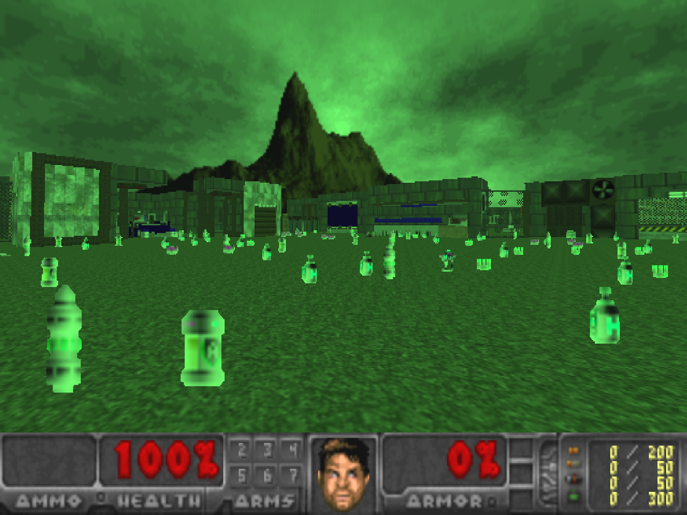

# HASARD: A Benchmark for Harnessing Safe Reinforcement Learning with Doom

**HASARD** (**Ha**rnessing **Sa**fe **R**einforcement Learning with **D**oom) is a benchmark for Safe Reinforcement Learning within complex,
egocentric perception 3D environments derived from the classic DOOM video game. It consists of 6 diverse tasks sequences 
across 3 levels of difficulty. HASARD challenges the agent to effectively integrate strategic planning, risk assessment, 
and adaptive learning within safe operating parameters.

[//]: # (A short demo of HASARD is available on [Youtube](https://www.youtube.com/watch?v=FUm2B8MZ6d0&list=PL6nJZHA3y2fxQK73jmuI5teM3n6Mydcf7).)
<p align="center">
  

[//]: # (  )
</p>

[//]: # ( TODO Add three gifs side by side, each for one level. Combine 6 clips of every env for each. Synchronize them.)

| Environment             | Level 1                                                                                                  | Level 2                                                                                              | Level 3                                                                                              |
|-------------------------|----------------------------------------------------------------------------------------------------------|------------------------------------------------------------------------------------------------------|------------------------------------------------------------------------------------------------------|
| **Armament Burden**     |    |     |     |
| **Detonator’s Dilemma** |  |  |  |
| **Volcanic Venture**    |   |    |    |
| **Precipice Plunge**    |   |    |    |
| **Collateral Damage**   |  |   |   |
| **Remedy Rush**         |        |         |         |


### Key Features
- **Egocentric Perception**: Agents operate from a first-person viewpoint, necessitating robust visual processing to successfully navigate the environment.
- **Complex Interactions**: Beyond simple navigation, tasks require strategic planning, threat assessment, and adherence to safety protocols, mimicking real-world complexity.
- **Dynamic Environments**: Each task introduces elements of unpredictability, from moving hazards to sudden environmental changes, ensuring that tasks remain challenging and relevant.

## Installation
To install HASARD, simply clone or download the repository and run:
```bash
$ pip install .
```

## Getting Started
Below we provide a short code snippet to run a HASARD task.

```python
import hasard

env = hasard.make('ArmamentBurdenLevel1-v0')
env.reset()
terminated = truncated = False
steps = total_cost = total_reward = 0
while not terminated or not truncated:
    action = env.action_space.sample()
    state, reward, cost, terminated, truncated, info = env.step(action)
    env.render()
    steps += 1
    total_cost += cost
    total_reward += reward
print(f"Episode finished in {steps} steps. Reward: {total_reward:.2f}. Cost: {total_cost:.2f}")
env.close()
```

# Acknowledgements

HASARD environments are built on top of the [ViZDoom](https://github.com/mwydmuch/ViZDoom) platform.  
Our Safe RL baseline methods are implemented in [Sample-Factory](https://github.com/alex-petrenko/sample-factory).  
Our experiments were managed using [WandB](https://wandb.ai).

[//]: # (The `Cross-Domain` task sequences and the `run_and_gun` scenario environment modification were inspired by the [LevDoom]&#40;https://github.com/TTomilin/LevDoom&#41; generalization benchmark.  )
